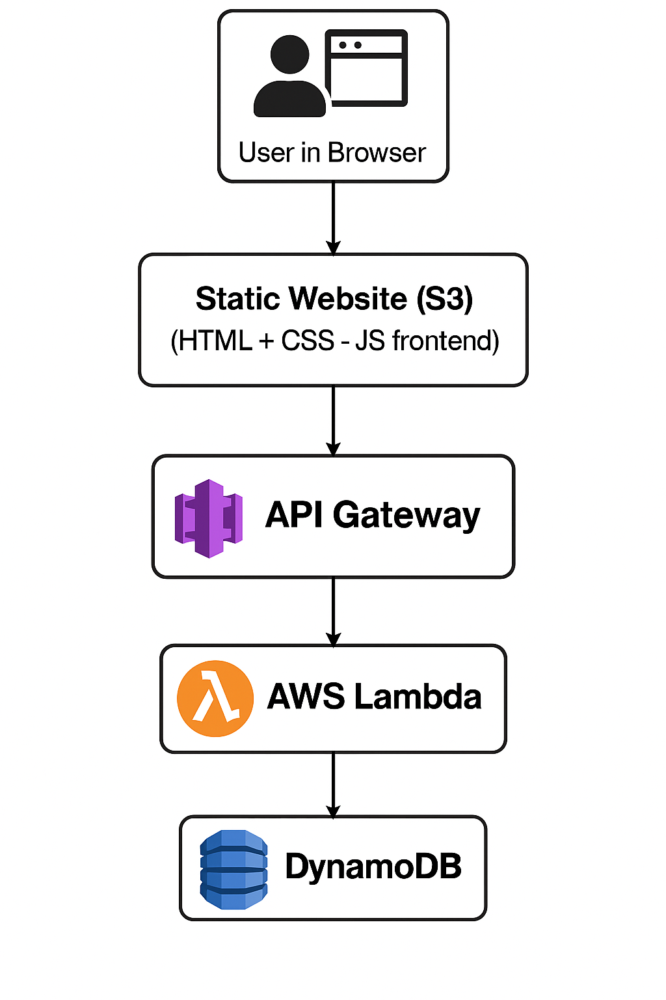

# 📝 Serverless App (AWS)

This is a fully serverless TODO application built using AWS services.

## 🚀 Features

- Static frontend hosted on **Amazon S3**
- REST API with **Amazon API Gateway (HTTP API)**
- Backend logic using **AWS Lambda** (Python)
- Task storage in **DynamoDB**

## 🧱 Architecture

## 🔧 Technologies Used

- HTML, CSS, JavaScript (Frontend)
- AWS Lambda (Python)
- Amazon API Gateway
- Amazon S3
- Amazon DynamoDB

## 🛠️ Setup

### 1. Deploy Backend

- Create DynamoDB table (e.g., `Tasks`) with `task_id` as primary key.
- Deploy Lambda functions for adding and retrieving tasks.
- Connect them to routes using API Gateway.

### 2. Deploy Frontend

- Upload HTML/CSS/JS to S3
- Make the bucket public (or use CloudFront in future)

### 3. Try it Out

- Visit: `[http://your-bucket.s3-website.region.amazonaws.com/](http://webdevadmin-bucket.s3-website.eu-north-1.amazonaws.com/)`
- Add and view your TODOs!

## 💡 Next Steps (Optional Features)

- Add authentication with Cognito
- Protect API with Cognito authorizers
- Use CloudFront for CDN + HTTPS

## 📄 License

MIT
